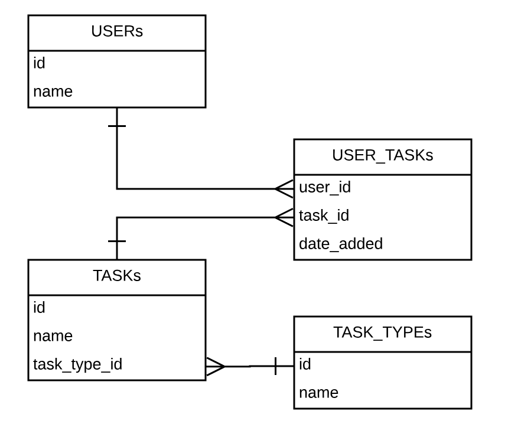

# Module One Final Project "Droid Bot"

## Overview
Droid Bot implements a bot named "Droid" in Slack.  Droid can respond to requests for weather or stock quotes, build a to-do list, or run a timer.

Weather is provided by https://www.metaweather.com/api/

Stock quotes are provided by https://www.alphavantage.co/documentation/#time-series-data

The interaction with Droid is accumulated in a database, as shown in this diagram:

Droid knows the stock quotes, weather, and to-do items for each user.  The current to-do list is displayed each time an item is added.  Each day the to-do list starts over. 

## Implementing a Slack Bot
It is recommended that you create a new Workspace for your bot.

1. Then create an app here https://api.slack.com/apps

2. Create a bot user (which is within your app).

3. Install the app in your workspace.

4. Copy the Bot User OAuth Access Token and export it to your environment:
	export SLACK_API_TOKEN= <your api token>

Note that if you quit your terminal, you will have to export the token again.

Code examples for various types of bots may be found here: https://github.com/slack-ruby/slack-ruby-bot

## Droid Interaction
Droid responds to the following requests:

* Weather in  **_city_**

* Quote **_stock symbol_**

* TODO: **_your to do item_**

* Timer: **_number of seconds_**

A user may also see the history of their interactions by asking Droid:

* Weather history

* Quote history

* TODO history

